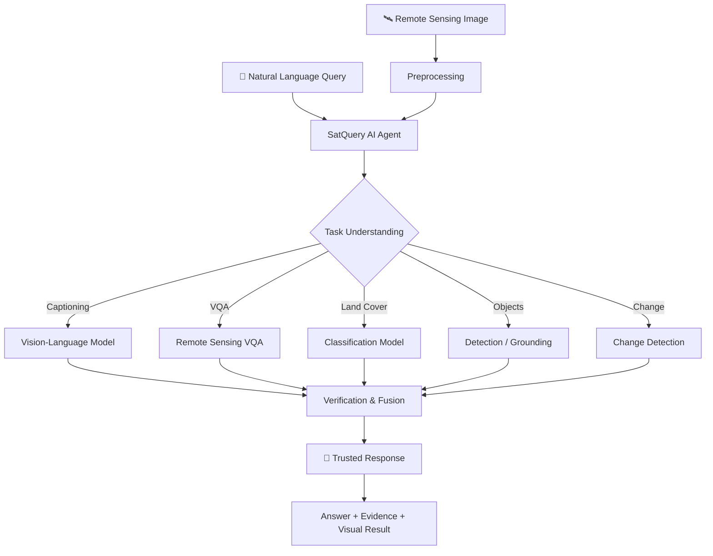

# 🛰️ SatQuery AI

> **An Interactive Vision-Language Assistant for Multimodal Remote Sensing Image Analysis through Text Queries**

SatQuery AI is an AI-powered geospatial assistant that lets users **upload satellite/remote-sensing imagery and ask questions in natural language**. Instead of requiring users to select separate GIS tools or specialized models, SatQuery AI routes each request through an intelligent analysis workflow and returns a grounded, interpretable result.

[](https://www.python.org/)
[](https://pytorch.org/)
[](https://huggingface.co/docs/transformers)
[](#-applications)
[](#)

---

## 🌍 The Idea

Remote-sensing imagery contains enormous amounts of information, but extracting it often requires knowledge of:

- Satellite sensors and image bands
- GIS software and geospatial workflows
- Computer-vision models
- Task-specific AI systems
- Remote-sensing terminology

**SatQuery AI changes the interaction model.**

Instead of asking:

> *"Which model should I use for this image?"*

the user can simply ask:

> **"What land-cover types are visible in this image?"**

> **"What changed between these two images?"**

> **"Is there a built-up area near the river?"**

> **"Describe the major objects and patterns visible here."**

The system interprets the request, selects the appropriate analysis capability, verifies the result, and presents the answer in a user-friendly form.

---

## ✨ What Makes SatQuery AI Different?

```text
┌───────────────────────┐
│   Satellite Images    │
│  Optical / SAR / EO   │
└───────────┬───────────┘
            │
            ▼
┌───────────────────────┐
│   Natural Language    │
│        Query          │
└───────────┬───────────┘
            │
            ▼
┌──────────────────────────────┐
│      🧠 SatQuery AI Agent    │
│                              │
│ Intent • Task • Context      │
└──────────────┬───────────────┘
               │
       ┌───────┼────────┐
       ▼       ▼        ▼
   Caption   VQA     Detection
       │       │        │
       └───────┼────────┘
               ▼
┌──────────────────────────────┐
│     🔎 Verify & Fuse         │
│ Cross-check model outputs    │
└──────────────┬───────────────┘
               ▼
┌───────────────────────┐
│   🎯 Trusted Output   │
│ Answer + Evidence     │
└───────────────────────┘
```

### Core principle

**One interface → multiple remote-sensing AI capabilities → one grounded answer.**

---

## 🖼️ Product Experience

### 1. Upload

Upload one or more remote-sensing images.

### 2. Ask

Describe the task naturally using a text query.

### 3. Analyze

SatQuery AI determines the required analysis and invokes the relevant specialist capability.

### 4. Verify

Results are cross-checked and fused where multiple models or evidence sources are available.

### 5. Understand

The user receives a concise answer with supporting visual/contextual information.

---

## 🏗️ System Architecture



---

## 🧠 Agentic Workflow

SatQuery AI is designed around a modular AI-agent workflow rather than a single monolithic model.

```text
User Query
    │
    ▼
┌────────────────────┐
│ Query Understanding│
└─────────┬──────────┘
          ▼
┌────────────────────┐
│ Task Classification│
└─────────┬──────────┘
          ▼
┌────────────────────┐
│ Model / Tool Route  │
└─────────┬──────────┘
          ▼
┌────────────────────┐
│ Specialist Analysis│
└─────────┬──────────┘
          ▼
┌────────────────────┐
│ Verification       │
└─────────┬──────────┘
          ▼
┌────────────────────┐
│ Response Generation│
└─────────┬──────────┘
          ▼
       Result
```

This architecture makes the system easier to extend with new remote-sensing capabilities without redesigning the entire application.

---

## 🔬 Supported Analysis Directions

| Capability | Example Query |
|---|---|
| 📝 Image Captioning | "Describe this satellite image." |
| ❓ Visual Question Answering | "What is visible in the northern part?" |
| 🌱 Land-Cover Analysis | "Which land-cover categories are present?" |
| 🏙️ Urban Analysis | "Identify major built-up regions." |
| 🎯 Object / Region Grounding | "Where are the buildings?" |
| 🔄 Change Detection | "What changed between these two images?" |
| 🗺️ Geospatial Interpretation | "Explain the major spatial patterns." |

> The exact capabilities available depend on the models and datasets integrated into the deployed version.

---

## 🧩 Technology Stack

### AI / ML

- **Python**
- **PyTorch**
- **Hugging Face Transformers**
- Vision-Language Models
- Remote-sensing foundation/specialist models
- QLoRA / LoRA for efficient adaptation

### Candidate Model Family

The research workflow has explored models including:

- **Qwen2.5-VL-7B-Instruct**
- **RSCoVLM-7B**
- Task-specific remote-sensing models

### Data

SatQuery AI can be evaluated using public remote-sensing datasets such as:

- **BigEarthNet**
- **VRSBench**
- **RSVQA**
- Sentinel imagery
- Landsat imagery

---

## 📊 Benchmarking

The system is designed to evaluate both general visual-language understanding and task-specific remote-sensing performance.

### Example evaluation dimensions

```text
                 SatQuery AI Evaluation
                         │
        ┌────────────────┼────────────────┐
        ▼                ▼                ▼
   VQA Accuracy     Caption Quality   Grounding
        │                │                │
        └────────────────┼────────────────┘
                         ▼
                  Change Detection
                         │
                         ▼
                  Overall Reliability
```

Potential metrics include:

| Task | Example Metrics |
|---|---|
| Classification | Accuracy, F1 |
| VQA | Accuracy |
| Captioning | BLEU, ROUGE, CIDEr |
| Grounding | IoU, Recall |
| Change Detection | F1, IoU |
| Retrieval | Recall@K |

---

## 📚 Datasets Used / Explored

### BigEarthNet

A large-scale benchmark for multi-label land-cover classification using Sentinel-1 and Sentinel-2 imagery.

**Use in SatQuery AI:** land-cover representation and benchmarking.

### VRSBench

A remote-sensing vision-language benchmark containing captioning, grounding and VQA tasks.

**Use in SatQuery AI:** multimodal language understanding and evaluation.

### RSVQA

A remote-sensing visual question answering dataset.

**Use in SatQuery AI:** natural-language question answering over satellite imagery.

---

## 🚀 Example

### Input

```text
🖼️ Satellite Image

💬 Query:
"What land-cover types are visible in this image?"
```

### SatQuery AI

```text
1. Understand query
        ↓
2. Identify land-cover task
        ↓
3. Route to relevant model
        ↓
4. Analyze image
        ↓
5. Verify prediction
        ↓
6. Generate grounded response
```

### Output

```text
The image contains predominantly agricultural
land, with smaller regions of built-up areas
and vegetation.
```

---

## 🎯 Applications

SatQuery AI can support workflows in:

- 🌾 **Agriculture & Crop Monitoring**
- 🌊 **Flood & Disaster Assessment**
- 🏙️ **Urban Planning**
- 🌲 **Forest Monitoring**
- 💧 **Water Resource Monitoring**
- 🛣️ **Infrastructure Mapping**
- 🌍 **Environmental Monitoring**
- 🛰️ **Geospatial Intelligence**
- 🔬 **Remote-Sensing Research**

---

## 💡 Key Innovations

### 1. Natural-Language First

Users interact with satellite imagery using ordinary language rather than specialized GIS commands.

### 2. Multi-Task Architecture

Different remote-sensing AI capabilities can be accessed through a unified interface.

### 3. Intelligent Routing

The agent determines what type of analysis a query requires and routes it accordingly.

### 4. Verification & Fusion

Multiple outputs can be checked and combined before generating the final response.

### 5. Modular Design

New models and tools can be added without rebuilding the complete system.

### 6. Human-Centered Geospatial AI

The goal is to make advanced remote-sensing analysis accessible to users who may not be experts in satellite imagery or machine learning.

---

## 📁 Suggested Project Structure

```text
SatQuery-AI/
│
├── frontend/
│   ├── components/
│   ├── pages/
│   └── assets/
│
├── backend/
│   ├── api/
│   ├── services/
│   └── schemas/
│
├── models/
│   ├── vlm/
│   ├── classification/
│   ├── detection/
│   └── change_detection/
│
├── agent/
│   ├── router.py
│   ├── planner.py
│   └── verifier.py
│
├── data/
│   ├── preprocessing/
│   └── evaluation/
│
├── notebooks/
│
├── tests/
│
├── requirements.txt
├── .env.example
└── README.md
```

---

## ⚙️ Installation

### 1. Clone the repository

```bash
git clone https://github.com/<your-username>/SatQuery-AI.git
cd SatQuery-AI
```

### 2. Create a virtual environment

```bash
python -m venv .venv
```

Activate it:

**Windows**

```bash
.venv\Scripts\activate
```

**Linux / macOS**

```bash
source .venv/bin/activate
```

### 3. Install dependencies

```bash
pip install -r requirements.txt
```

### 4. Configure environment variables

Create `.env`:

```env
MODEL_NAME=<model-name>
DEVICE=cuda
HF_TOKEN=<your-huggingface-token>
```

### 5. Run the application

```bash
python app.py
```

---

## 🖥️ Hardware

For development and experimentation, GPU acceleration is recommended.

Example research environment:

```text
GPU       : NVIDIA Tesla T4
Framework : PyTorch
CUDA      : Enabled
Training  : QLoRA / LoRA
```

Larger vision-language models may require significantly more GPU memory depending on quantization, batch size, image resolution and inference configuration.

---

## 🔐 Responsible AI

Satellite imagery can contain sensitive geographic information. SatQuery AI should therefore:

- Clearly communicate model uncertainty.
- Avoid presenting predictions as ground truth.
- Preserve provenance of datasets and imagery.
- Respect licensing and usage restrictions.
- Apply appropriate safeguards to sensitive geospatial data.
- Provide human review for high-impact decisions.

---

## 🛣️ Roadmap

```text
                         SatQuery AI
                              │
             ┌────────────────┼────────────────┐
             ▼                ▼                ▼
        Multimodal        More Models      Better Agent
        Understanding       & Tools          Routing
             │                │                │
             └────────────────┼────────────────┘
                              ▼
                    Geospatial Reasoning
                              │
                              ▼
                     Real-Time Imagery
                              │
                              ▼
                 Production-Scale Platform
```

### Planned improvements

- [ ] Multi-image reasoning
- [ ] Temporal change analysis
- [ ] Interactive map integration
- [ ] Geo-coordinate aware responses
- [ ] Explainable visual evidence
- [ ] More Sentinel/Landsat workflows
- [ ] Model confidence estimation
- [ ] Efficient edge/cloud inference
- [ ] Real-time geospatial data integration
- [ ] Production API and scalable deployment

---

## 🏆 Hackathon Context

**SatQuery AI** is designed for the **Smart India Hackathon** problem statement:

> **PS26167 — SatQuery AI: An Interactive Vision-Language Assistant for Multimodal Remote Sensing Image Analysis through Text Queries**

The project focuses on combining **remote sensing + computer vision + vision-language models + agentic AI** into a unified natural-language interface.

---

## 📖 Research Direction

SatQuery AI sits at the intersection of:

```text
Remote Sensing
      +
Computer Vision
      +
Vision-Language Models
      +
Agentic AI
      +
Geospatial Intelligence
      =
       🛰️ SatQuery AI
```

The broader research objective is to investigate how multimodal foundation models and specialized remote-sensing models can work together to make satellite-image analysis more interactive, explainable and accessible.

---

## 🤝 Contributing

Contributions are welcome.

```bash
git checkout -b feature/your-feature
git commit -m "Add: your feature"
git push origin feature/your-feature
```

Then open a Pull Request.

---

## 📜 License

Add the project's license here once the repository's licensing terms are finalized.

---

## 👨‍💻 Team

**SatQuery AI**

Built for intelligent, accessible and multimodal remote-sensing analysis.

---

<div align="center">

### 🛰️ Ask Satellites. Get Answers.

**SatQuery AI — Making Earth Observation Conversational.**

</div>
